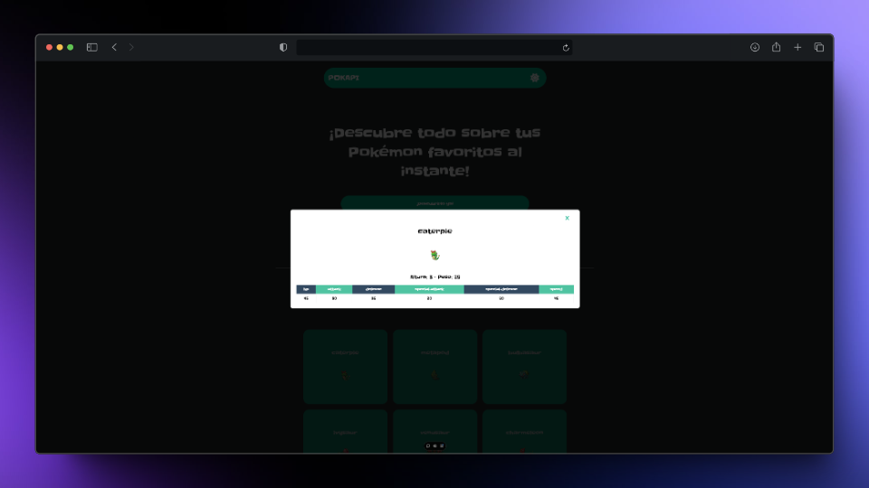

# POKAPI

POKAPI es una página web en la cual puedes ver cada uno de los pokemons junto con su tipo y stats.
Este proyecto ha sido llevado a cabo con la API de **[pokeapi.co](https://pokeapi.co/)**, que nos permite recopilar la información de cada uno de los pokemons disponibles.

## Tecnologías​ :hammer_and_wrench:

- 

- 

- 


## Clonar proyecto

```
git clone https://github.com/juanmagape/poke-api
```

## Vista Proyecto 💥

[Página del proyecto](https://poke-api-juanmagape.vercel.app/)

- Pantalla de inicio


- Modal con detalles de cada pokemon



------

Desarrollado por [**Juan Manuel**](https://www.linkedin.com/in/juanma-gape/) 🤘​
